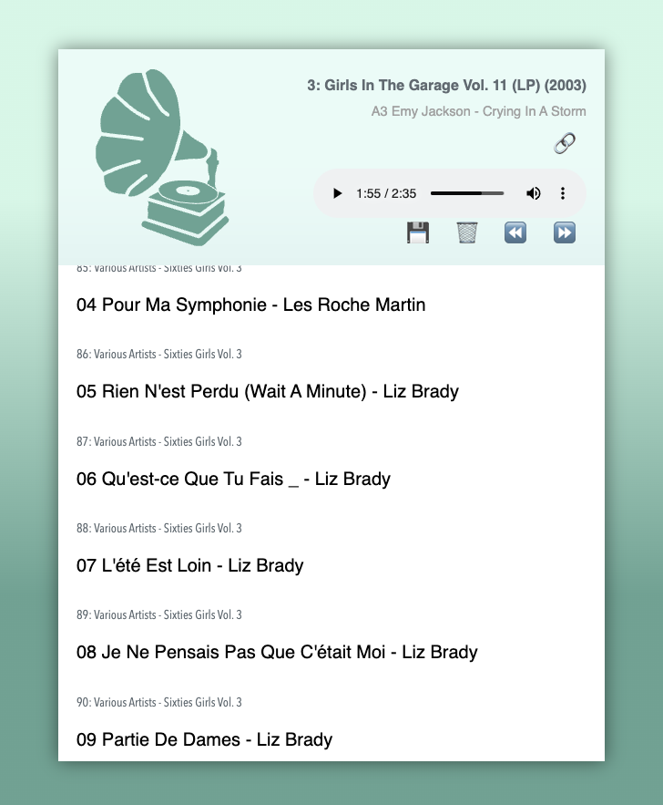

##### glowinthedark web audio player
---

# 🚀 🔗 [click for DEMO](https://glowinthedark.github.io/web-audio-player/) — drag audio URLs, HTML selections containing audio links, or local files into the demo page

Simple HTML+JS player that accepts dropped links from web pages or HTML selections — playable audio links will be extracted and added to the playlist.

- store last playlist in localstorage
- accept draggable audio URLs and HTML selections containing playable links
- accept audio files drag-n-drop from local file system, e.g. Finder, etc (audios are added as blobs and therefore cannot be saved as playable items on restore from localStorage)

## Screenshots

## Attributions 
- [Nate Northway's codepen](https://codepen.io/the_Northway/pen/wvzqRgv)
